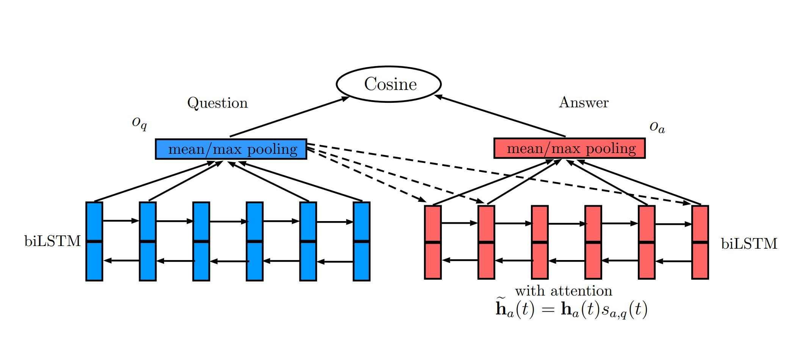

# Assignment 2 Instruction

### Experiment Environment

---

| Toolchain | python | cuda | torch |
|----|----|----|----
| Version| 3.7.4 | 10.1 | 1.3.1 |

### Project Directory 

---

```
|-data/V1 # data directory -  insurance QA V1 data
|-model # pre-trained Bi-lstm + attention model
|-pysrc # python source file directory
|-- main.py # program entrance, use -h to see arguments
|-- model.py # nn model class and nn utils functions
|-- preprocess.py # data preprocessing related functions 
```

### Execution Process

---

- **Preparations**
    - dataset: dataset(Insurance QA V1) is already prepared in the repository. Origin dataset repository: https://github.com/shuzi/insuranceQA 
    - word embedding: Create `embedding` directory at project root. Download word embedding data (`wget -c "https://s3.amazonaws.com/dl4j-distribution/GoogleNews-vectors-negative300.bin.gz"`) and unzip the file in `./embedding`
    - checkpoint: create `checkpoints` directory at project root directory to store trained model. 
- **Parameters**
    - Use `python pysrc/main.py -h` to check parameter settings. 
- **Model Training**
    - Run command `python pysrc/main.py --mode training` to train model by default settings.
    - default model is "bilstm + attention". Detailed net structure is shown the  figure.
    
    - The implementation is based on Paper [LSTM-BASED DEEP LEARNING MODELS FOR NONFACTOID ANSWER SELECTION](https://openreview.net/pdf?id=ZY9xwl3PDS5Pk8ELfEzP). Find algorithm details in the paper.
- **Evaluation**
    - Run command `python pysrc/main.py --mode evaluation` to evaluation model performance on test set.
    - Default test set is selected as test1. Use `--testset [dev/test1/test2]` option to change test set.
- **Simulation**
    - Run command `python pysrc/main.py --mode simulation` to enter simulation mode.
    - Simulation mode is used to work as a real qa bot, ask question in command line.
    - Invalid word is not allowed in this mode.
    - You can select a candidate questions to interact with qa bot. 
    - Simulation mode computes all similarities between question with every answer in the dataset, and then select the most similar answer.
    

### Experiment Result

This repository implemented 3 algorithm in the paper. Benchmark results are shown in the table.


| | Dev | Test1 | Test2 
|----|----|----|----
| QA-LSTM basic-model (avg pooling) | 52.56% | 61.16% | 57.33%
| QA-LSTM basic-model (max pooling) | 59.61% | 61,17% | 61.55%
| QA-LSTM with attention (avg pooling) | 60.25% | 63.23% | 62.44%

### Reference
- Tan, M., Santos, C. D., Xiang, B., & Zhou, B. (2015). Lstm-based deep learning models for non-factoid answer selection. arXiv preprint arXiv:1511.04108.
- Insurance QA Dataset. https://github.com/shuzi/insuranceQA
- Reference repository. https://github.com/jojonki/QA-LSTM